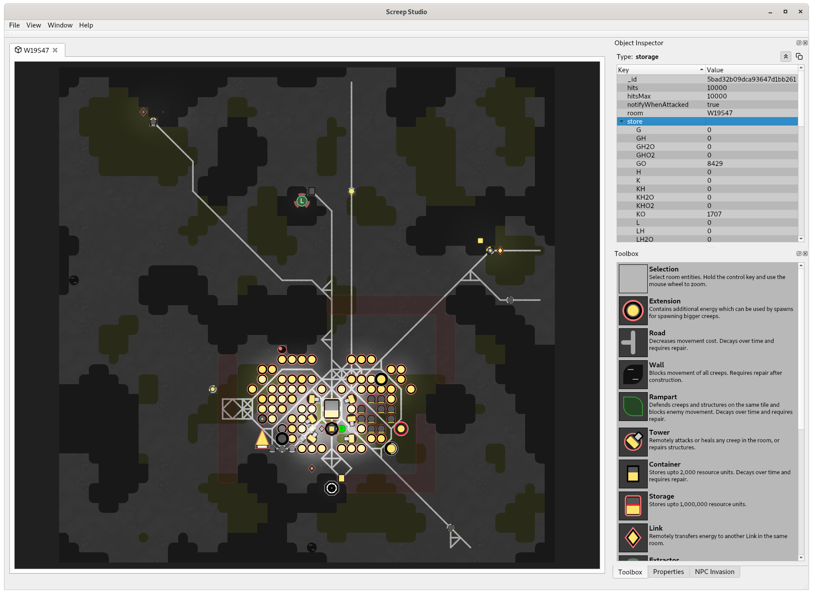
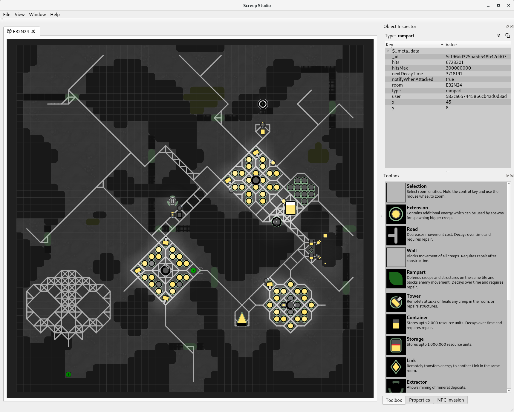

# Screep Studio

Screep Studio is a native cross platform client for the [Screeps](https://screeps.com/) MMO sandbox game for programmers.
It is written using the Qt Cross Platform C++ framework so should compile and run on Microsoft Windows, Mac OS and Linux.

The project was initially written as part of the Level1Techs ["Devember2k18"](https://forum.level1techs.com/t/devember-screep-studio/135653) coding event.

Note: Screep Studio is currently in development (on an ad-hoc basis) so it is far from complete. While it can successfully
connect to either a privately hosted server or the live Screeps server (probably not a great idea but the client is reasonably
stable and shouldn't doing anything crazy that might cause problems for the server) there is currently no UI for selecting a server,
logging on or opening rooms, for the moment this is hard-coded in [ScreepStudioApplication.cpp](ScreepStudioApplication.cpp)

## Features:

- Supports opening multiple rooms (Note: The live server currently on allows two room subscriptions but private servers can be modified
  to remove this restriction)

- Basic rendering for the following game entities:-

  Construction Sites, Containers, Controllers, Creeps, Invaders, Energy Deposits, Extensions, Extractors, Labs, Links,
  Minerals, Nukers, Observers, Power Spawns, Ramparts, Roads, Sources, Spawns, Storage, Terminals, Tombstones, Towers, Walls,
  Unknown Entities (a placeholder shown when the entity is not supported)

- A console window that can be used to execute commands and call Screeps APIs as well as displaying the output of logging APIs.
  Note: The console can be show/hidden using the Ctrl+C shortcut key or via the Window menu.

- An "Object Inspector" panel to display the raw JSON for a selected game entity.
  Note: The object inspector panel can be shown/hidden using the Ctrl+I shortcut key or via the Window menu.

- A toolbox panel containing the various game entities available for construction. Note: This is currently read-only.  

## TODO (Current priorities):

- Refamiliarise myself with the code and clean up the structure so I can continue working on it (it's been over a
  year since I did anything significant with the code base so it doesn't even feel like my own code)

- Add UI to setup server connections and authentication methods and allow the user to login/connect without having to
  hack the code.

- Re-work the network code. It really needs to be more robust and the connection sequence is a mess so I want to move
  to a state machine based approach (See [QStateMachine](https://doc.qt.io/qt-5/qstatemachine.html))

## Know Issues:

- Due to a bug in how the Qt Framework resolves the OpenSSL libraries the client will fail to connect to
  a secure web socket endpoint using Qt Framework versions prior to 5.12.1 (See [QTBUG-68156](https://bugreports.qt.io/browse/QTBUG-68156))
  If you experience this issue please make sure you are building the client against a later version of Qt.

- Screep Studio supports opening multiple rooms at the same time but the Screeps server currently limits the number of room subscriptions
  to 2. If you are using your own private server you can increase the subscription limit by modifying the "USER_LIMIT" constant in the
  room.js server source module which can be found in the following location on your server:-

      <install_path>/node_modules/@screeps/backend/lib/game/socket/room.js

- If you want to try to compile and run Screep Studio you will need to obtain an API key/authentication token based on the Screeps log in.
  Once you have your auth token you can either hard-code it in [ScreepStudioApplication.cpp](ScreepStudioApplication.cpp) or add it
  to the Security section of the "Screep Studio.conf" file.

      [Security]
      authKey=<Your authentication token here>

  Information on obtaining an authorisation token can be found [here](https://docs.screeps.com/auth-tokens.html)

- There's a lot of DEBUG code and partially implemented features in the source.

## Unknown Issues:

- Lots ... Screep Studio is just something I work on for fun so there's lots more work required and most likely lots of issues to be resolved.

## What it looks like...

### Video
A short video showing the client running can be found [here](https://youtu.be/dZnie-9v39c)

There's also a playlist showing the development of Screep Studio [here](https://www.youtube.com/playlist?list=PLxFqsJkRoZf8zN44B-1vD27toUQzQdZmc)

### Screenshot 1

### Screenshot 2

