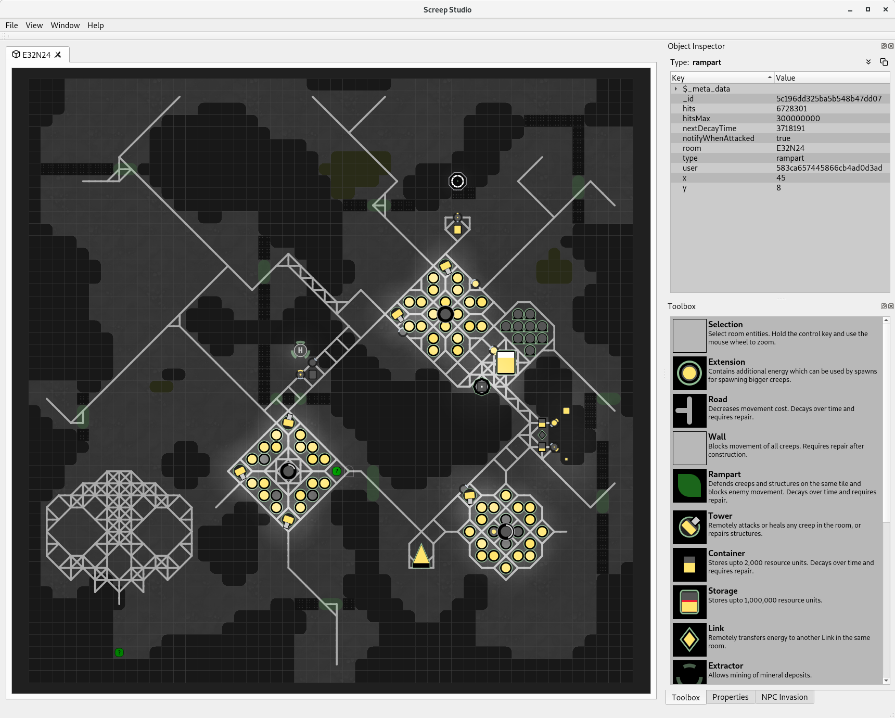

# Screep Studio

Screep Studio is a native cross platform client for the [Screeps](https://screeps.com/) MMO sandbox game for programmers.
It is written using the Qt Cross Platform C++ framework so should compile and run on Microsoft Windows, Mac OS and Linux.

Note: Screep Studio is currently in development (on an ad-hoc basis) so it is far from complete. While it can successfully
connect to either a privately hosted server or the live Screeps server (probably not a great idea but the client is reasonably
stable and shouldn't doing anything that might cause problems for the server) there is currently no UI for selecting a server,
logging on or opening rooms, for the moment this is hard-coded in [ScreepStudioApplication.cpp](ScreepStudioApplication.cpp)

# Features:

- Supports opening multiple rooms (Note: The live server currently on allows two room subscriptions but private servers can be modified
  to remove this restriction)

- Basic rendering for the following game entities:-

    Construction Sites, Containers, Controllers, Creeps, Energy Deposits, Extensions, Extractors, Labs, Links, Minerals,
    Nukers, Observers, Power Spawns, Ramparts, Roads, Sources, Spawns, Storage, Terminals, Tombstones, Towers, Walls,
    Unknown Entities (a placeholder shown when the entity is not supported)

- A console window that can be used to execute commands and call Screeps APIs as well as displaying the output of logging APIs.
  Note: The console can be show/hidden using the Ctrl+C shortcut key or via the Window menu.

- An "Object Inspector" panel to display the raw JSON for a selected game entity.
  Note: The object inspector panel can be shown/hidden using the Ctrl+I shortcut key or via the Window menu.

- A toolbox panel containing the various game entities available for construction. Note: This is currently read-only.  

# Know Issues:

 - At the time of writing the Qt Framework seems to have an issue when connecting to WebSockets over SSL. This seems to be a particular
   issue on Linux. As far as I can tell, the current Qt libraries expect to find OpenSSL v1.0.2 installed (OpenSSL 1.0.2k-fips  26 Jan 2017)
   and will fail to connect if a matching library is not found. For the moment I am working around the problem by adding a symbolic link to
   the build directory for libssl.so that points to a compatible library

   e.g. libssl.so -> /usr/lib64/libssl.so.1.0.2o

   Note: There is a bug logged against the Qt Framework for this issue (TODO: Reference bug)

 - If you want to try to compile and run Screep Studio you will need to obtain an API key/authentication token based on the Screeps log in.
   Once you have your auth token you can either hard-code it in [ScreepStudioApplication.cpp](ScreepStudioApplication.cpp) or add it
   to the Security section of the "Screep Studio.conf" file.

   e.g [Security]
       authKey=<Your authentication token here>

   Information on obtaining an authorisation token can be found here https://docs.screeps.com/auth-tokens.html

# Unknown Issues:

 - Lots ... Screep Studio is just something I work on for fun so there's lots more work required and most likely lots of issues to be resolved.

# Example screenshot 1

# Example screenshot 2

